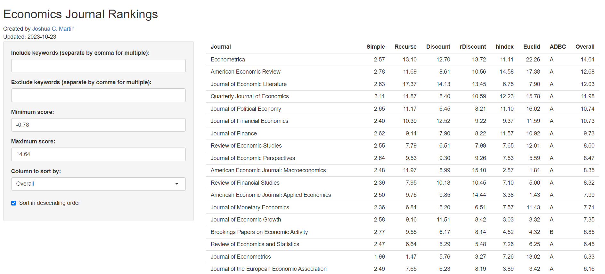
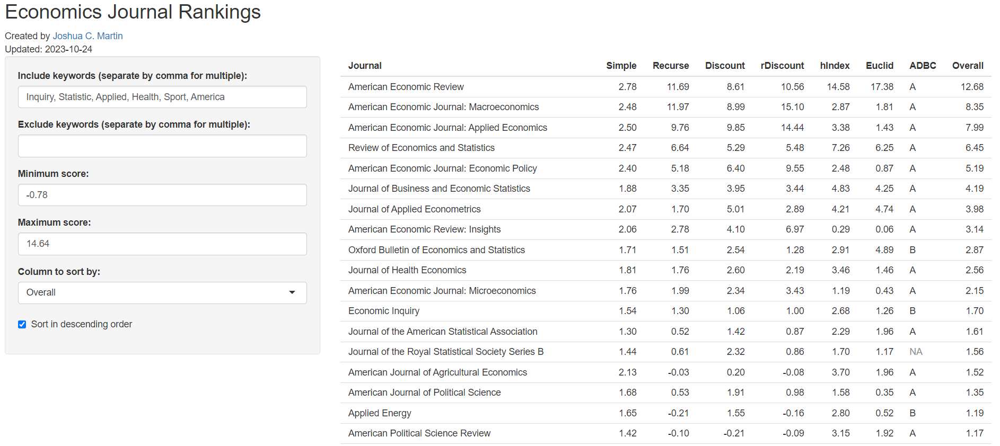
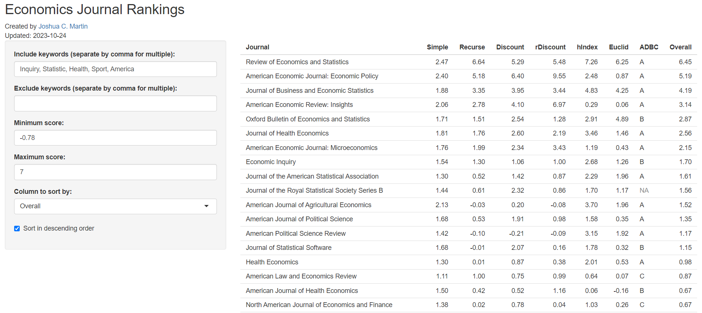
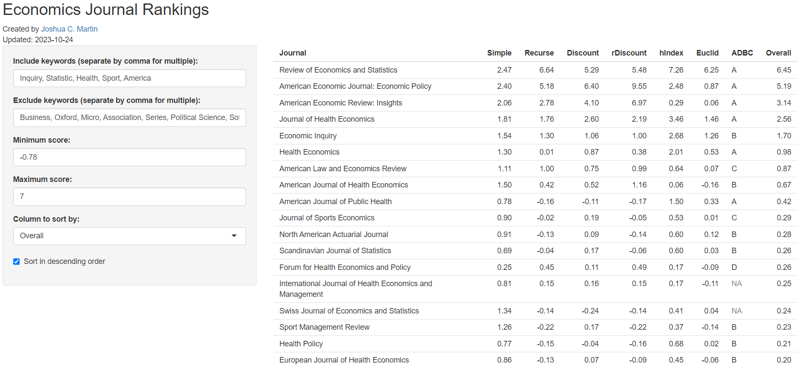
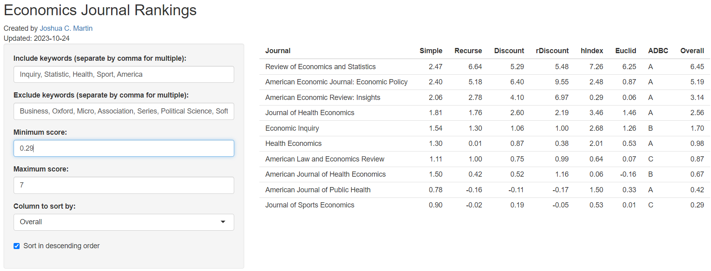

# Econ Journal Rankings

I created an interactive [shiny](https://shiny.posit.co/) app using R to determine what journals to send econ papers. 

[Source Code](https://github.com/joshmartinecon/econ-journal-rankings/tree/main/code%20and%20data)

## Functionality

There are two primary types of interactivity: filtering and sorting. One can filter by the name of journal both in what names to include and exclude. **This filtering function is case sensitive.** Commas must be added if one wishes to filter by multiple topics.  Additionally, one can filter based on the "overall score" (whose calculation is discussed further below). Finally, one can sort according to their preferred ranking method -- of which 8 are provided.

## Data 

Data comes from two sources: [IDEAS/RePEc](https://ideas.repec.org/) 10-year impact factors ([Simple](https://ideas.repec.org/top/top.journals.simple10.html), [Recursive](https://ideas.repec.org/top/top.series.recurse10.html), [Discount](https://ideas.repec.org/top/top.series.discount10.html), [Recursive Discount](https://ideas.repec.org/top/top.series.rdiscount10.html), [H-Index](https://ideas.repec.org/top/top.series.hindex10.html),
and [Euclian](https://ideas.repec.org/top/top.series.euclid10.html)) and the [Australian Business Deans Counsel Journal Quality List](https://abdc.edu.au/abdc-journal-quality-list/)).^[1]

## Methods

Each variable from the data sources discussed above is represented by value $x$ of journal $j$. I log transform each of these variables to the influence of outliers. A value of 0.01 is added to avoid issues of the output being undefined.

$$y_j = log \Big(x_j + \dfrac{1}{100} \Big)$$

These log-transformed variables are converted into z-scores.

$$z_j = \dfrac{y_j - \bar{y}}{\sigma_y}$$

The final index value takes an average of these z-scores across each of the $n$ number of $x$ variables. Missing values are omitted from this calculation. The ABDC values are not included due to the discrete nature of numerically converting the alphabetical scores.

$$i_j = \dfrac{1}{n} \sum_n z_j$$

## Example

I will use one of my (already published) research papers as an example. The paper is on the [impact of basketball All Star "Magic" Johnson's disclosure of his HIV+ status on subsequent AIDS diagnoses and longevity of heterosexual men](https://doi.org/10.1002/hec.4712).

This paper is an applied paper in microeconomics. Two good words indicating these two general themes within this field are "Statistics" and "Applied". Within the applied micro sub-field, this is a health paper with a sports setting. Thus, I will search for any journal with the title "Sport" and "Health". Given that the setting is within the United States, I will search for "America". Finally, I know that Economic Inquiry publishes sports papers from time to time. Thus, I also include "Inquiry".

**Included words**: Inquiry, Statistic, Applied, Health, Sport, America

Lets assume that the *Review of Economics and Statics* is the highest ranked journal at which I could plausibly see us receiving an R&R. Thus, I set the "Maximum score" variable on the left-hand side equal to 7. This excludes the *AER*, *AEJ:Macro* and *AEJ:AE*.

Let us further refine this list. While this is an applied paper, the phrase "microeconomics" often indicates a more theoretical approach. Thus, we remove "Micro". Let's also remove other visible journals from the top of the list which do not fit this field such as "Business", "Political Science", "Finance" and "Agricultur".^[2] There are lots of journals that I see that are a part of a broader conversation such as "Annals", "Association" and "Series" which I wish to omit. Further, given the American setting, let us omit "Oxford" and "Latin". Finally, lets drop the computer dorks (<3) with "Software", "Mechanics" and "Comput".^[3]

**Excluded Words**: Micro, Business, Political Science, Finance, Agricultur, Annals, Association, Series, Oxford, Latin, Software, Mechanics, Comput

Finally, lets identify a journal whose "ranking" (according to my wack index) is the lowest that we would accept in the paper's current form. Hypothetically, I chose the *Journal of Sports Economics*. In my index, it has a value of 0.29. Thus, I set this as the "Minimum Score" in the area on the left-hand side.

## Disclaimers

1. This app only *attempts* to provide numerical rankings to each of the economics (and economics-related) academic journals. Clearly, there is a huge degree of subjectivity in these rankings. This work should not be interpreted as anything beyond a sloppy, first attempt at providing one with a set of possible future homes for research papers.

2. The app is slow, crashes often and I am sure there are bugs. I'll attempt to fix them as they arise. It can help to close out of other applications and websites if the app is crashing frequently.
  
3. Despite what the "Updated" variable says in the upper left-hand corner, this app has not been updated since Summer '23.

4. The app will "disconnect" if left alone too long. Just reload your webpage to fix this.

### Footnotes

^[1]: [Scimago Journal & Country Rank](https://www.scimagojr.com/) is also used in matching journal names. HI personally dislike the rankings they provide.

^[2]: This is a purposeful misspelling since it will capture both "Agriculture" and "Agricultural".

^[3]: Once again, this is a purposeful misspelling to capture both "Computer" and "Computing".
